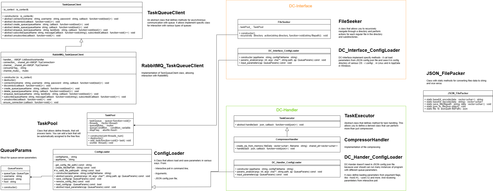

# Distribute-Compressor

Distribute-Compressor is a project suite that enables recursive directory traversal and file compression into ZIP archives. It utilizes a task queue system to distribute compression tasks across DC-Handler instances, supporting multiple queue implementations including RabbitMQ and a planned DC-Queue (custom solution).

# Components

### DC-Interface

The control program that:
1. Recursively scans directories
2. Converts file metadata to JSON
3. Manages queue communication
4. Receives processed results

##### Using

Before you send files to queue - you should set parameters for queue. For instance, if you use RabbitMQ - set host, username and password. There are different ways to do this.

You can set parameters through arguments of command line, like:

``` bash
distributed_compressor_interface --queue-type RabbitMQ --host example.com --user admin --password admin
```

or the same

``` bash
distributed_compressor_interface --queue-type RabbitMQ --host example.com --user admin --password admin
```

DC-Interface saves last configuration in config-file. It allows you don\'t repeat queue-parameters in the next program launch.

All flags for DC-Interface:

| Flag | Full Named Flag | Meaning                            |
|:---: |:---------------:| :----------------------------------|
| -QT  | --queue-type    | set queue-type [RabbitMQ, DC-Queue]|
| -H   | --host          | set hostname of Queue              |
| -U   | --user          | set username of Queue profile      |
| -P   | --password      | set password of Queue profile      |
| -RC  | --ResetConfig   | reset config-file                  |

Next, you can launch `distributed_compressor_interface`:

``` bash
distributed_compressor_interface ~/Desktop/exampleDirectory
```

If you don\'t send parameters or set not all parameters, you should set the absent parameters in interactive poll. Next this parameters will store in config-file(in ~/.config/... directory on Linux and in AppData on Windows).

### DC-Handler

DC-Interface if program that uses for processing tasks, that received from Queue. It perform compressing and send result to result-queue.

##### Using

To start a DC-Handler:

``` bash
distributed_compressor_handler
```

The program will prompt for required parameters in interactive mode.

Alternatively, you can provide all parameters directly:

``` bash
distributed_compressor_handler --queue-type RabbitMQ --host example.com --user admin --password admin
```

Flags:

| Flag | Full Named Flag | Meaning                            |
|:---: |:---------------:| :----------------------------------|
| -QT  | --queue-type    | set queue-type [RabbitMQ, DC-Queue]|
| -H   | --host          | set hostname of Queue              |
| -U   | --user          | set username of Queue profile      |
| -P   | --password      | set password of Queue profile      |

Note: These parameters are not stored in a config file to allow running multiple handler instances on the same machine.

### DC-Queue

Custom implementation of Task-Queue.(Not implemented yet)

# Building

This project requires some additional libraries:

1. Boost
2. LibArchive
3. AMQP-CPP

Before building, you should install these dependencies. For example, use `apt install libarchive-dev libboost-all-dev`. It is recommended to build like dynamic library AMQP-CPP from source (https://github.com/CopernicaMarketingSoftware/AMQP-CPP).

Next, go to the root directory of the project and build the project using CMake.

# Project Structure


#### tree-structure:

```
.
├── CMakeLists.txt
├── DC-Handler
│   ├── CMakeLists.txt
│   ├── include
│   │   ├── CompressHandler.hxx
│   │   ├── DC_Handler_ConfigLoader.hxx
│   │   └── TaskExecutor.hxx
│   └── src
│       ├── CompressHandler.cxx
│       ├── DC_Handler_ConfigLoader.cxx
│       └── main.cxx
├── DC-Interface
│   ├── CMakeLists.txt
│   ├── include
│   │   ├── DC_Interface_ConfigLoader.hxx
│   │   └── FileSeeker.hxx
│   └── src
│       ├── DC_Interface_ConfigLoader.cxx
│       ├── FileSeeker.cxx
│       └── main.cxx
├── DC-Queue
│   ├── include
│   └── src
│       └── main.cxx
├── images
│   └── UML_diagram.png
├── include
│   ├── CMakeLists.txt
│   ├── ConfigLoader.hxx
│   ├── JSON_FilePacker.hxx
│   ├── nlohmann
│   │   └── json.hpp
│   ├── queue_input_strategy
│   │   ├── DC_Queue_QueueInputStrategy.hxx
│   │   ├── QueueInputStrategy.hxx
│   │   └── RabbitMQ_QueueInputStrategy.hxx
│   ├── QueueParams.hxx
│   ├── RabbitMQ_TaskQueueClient.hxx
│   ├── TaskPool.hxx
│   └── TaskQueueClient.hxx
├── README.md
└── src
    ├── CMakeLists.txt
    ├── ConfigLoader.cxx
    ├── RabbitMQ_TaskQueueClient.cxx
    ├── TaskPool.cxx
    └── TaskQueueClient.cxx
```
